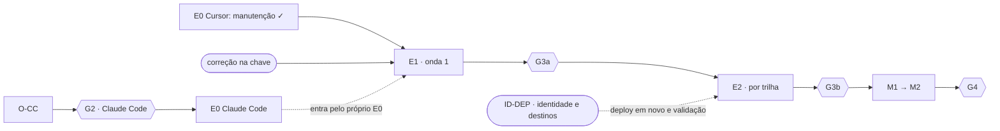

# Implementação do fluxo aprovado de agentes

Estado em 2026-10-07. Este é o único lugar com estado e histórico do harness. READMEs, roteiros, catálogo e `agentes/roteamento.yaml` descrevem só o comportamento vigente.

## Intenção

Tornar executável, no Cursor e no Claude Code, o fluxo de agentes do desenho ([trilhas e fluxogramas](user-harness-esteira-v4.html#trilhas)). Ao final:

1. **Papéis certos em cada trilha.** O agente principal coordena, e cada trilha estruturada chama os papéis previstos (`map`, `config`, `implement`, `test`, `refute`, `docs` e `dab`) na ordem aprovada e conforme o contrato da fatia. O principal não substitui um papel obrigatório em silêncio.
2. **Escrita, verificação e revisão separadas.** Quem altera não aprova o próprio trabalho. O teste parte do esperado contratado; a revisão recebe intenção e aceite, não o racional do autor; edição posterior invalida as duas.
3. **Execução comprovada por observação.** Chamada, log e artefato registrados pelo adaptador do runtime sustentam que um papel rodou. Relato do agente ou YAML escrito pelo principal não bastam.
4. **Fecho que recusa evidência incompleta.** `DONE` só com as chamadas previstas observadas, provas atuais e achados tratados. Sem isso, `BLOCKED`, `FAILED` ou `DECIDE`, com motivo e ponto de retomada.
5. **Mesmo comportamento nos dois runtimes**, declarado somente depois de observado em sessão real de cada um.

O plano não amplia autorização. Guardas, permissões do runtime e as regras de deploy/run do `AGENTS.md` prevalecem. Todas as regras para agentes ficam no harness: o produto não tem instruções de agente próprias.

## 1. Decisões aprovadas

O agente principal coordena: escolhe o caminho, delimita a fatia, define o aceite, delega, trata retornos, controla orçamento e publica o fecho. Diagnóstico, inspeção documental e paridade são capacidades, não agentes.

| Trilha estruturada | Sequência | Condições |
|---|---|---|
| Novo | map opcional → coordenador → config/implement → test → refute → dab se aplicável → coordenador | Config para YAML, implement para código, um de cada vez: janela de escrita sobreposta torna a autoria inconclusiva. |
| Manutenção | map opcional → coordenador → test prepara se necessário → config/implement → test → refute → dab se aplicável → coordenador | Test prepara só se os casos existentes não decidem o comportamento contratado. |
| Correção | diagnóstico com map opcional → coordenador → test reproduz → config/implement corrige → test revalida → refute → dab se aplicável → coordenador | Falha esperada na reprodução autoriza a escrita; aprovação inesperada vai para `DECIDE`, resultado inconclusivo para `BLOCKED`. Falha esperada não conclui a correção. |
| Documentação | map opcional → coordenador → docs → inspeção documental pelo coordenador → refute → coordenador | Sem suíte de produto sem relação com o documento. |
| Destilar | map opcional → coordenador → docs com distill → inspeção documental pelo coordenador → refute → coordenador | Destino e fonte autorizados; sem duplicar skills de plataforma. |
| Validação | coordenador → test → dab se autorizado → test com paridade se exigida → refute → coordenador | Para na reprovação conclusiva; não corrige produto. |
| Review | map opcional → coordenador → refute → coordenador | Veredito do artefato separado do status da tarefa; refute indisponível dá `BLOCKED`. |
| Entendimento | principal, com map opcional | Sem refute; fontes, inferências e preservação de estado verificáveis. |

Em toda trilha de escrita, `dab` entra pelo critério `ambiente` com autorização registrada, não pela trilha. Test e refute são obrigatórios onde previstos; config, implement, docs e dab, quando o gatilho se aplica; map é opcional. O caminho simples continua proporcional, e a classificação não serve para evitar obrigações do trabalho estruturado.

Agente obrigatório indisponível impede o sucesso: registrar `BLOCKED` e continuar o trabalho independente. Falta de decisão ou autorização humana: `DECIDE`. Permissões superiores do runtime prevalecem.

## 2. Contrato dos agentes

Cada papel tem definição neutra em `agentes/<papel>.md` (responsabilidade, gatilho, entradas, ferramentas, skills, capacidades, saída e término). `agentes/roteamento.yaml` é a fonte única da matriz: papéis por trilha, ordem, gatilhos, skills, capacidades e os metadados `politica`, `instalado` e `observado` por runtime. `adaptadores/gerar_agentes.py` gera `.claude/agents/` e `.cursor/agents/`, e `--verificar` acusa divergência. O HTML é editado à mão, e o teste A4 (`testes/teste_roteamento.py`) confere seus fluxos contra o roteamento.

### 2.1 Gatilhos

| Sinal no contrato | Papel previsto | Trilhas |
|---|---|---|
| Superfície com YAML de negócio, ingestão ou recurso | config | novo, manutenção, correção |
| Superfície com notebook, Python ou SQL | implement | novo, manutenção, correção |
| Superfície documental | docs | docs, destilar |
| Critério `teste`, `validacao_dados` ou `paridade` | test (reprodução e revalidação na correção) | novo, manutenção, correção, validação |
| Critério `ambiente` com autorização registrada | dab | novo, manutenção, correção, validação |
| Critério `inspecao_documental` ou `analise_codigo` | coordenador inspeciona | docs, destilar, review |
| Trilha estruturada, exceto entendimento | refute | todas, menos entendimento |
| Investigação ampla | map, sempre opcional | todas |

`iniciar` calcula o plano de chamadas a partir do roteamento e do contrato e o grava no estado da fatia. Só a chamada observada pelo adaptador conta como execução.

### 2.2 Skills e capacidades

Carregar só a skill pertinente, citá-la na linha `Skills:` do retorno e não presumir herança do principal. Capacidades obrigatórias: `diagnostico` na correção, `paridade` quando o contrato tem critério `paridade`, `distill` em destilar e a referência às guardas no `dab`; as demais são orientativas (roteamento). O Claude Code usa `databricks:databricks-<nome>` pelo plugin, também no subagente; Cursor, Codex e OpenCode leem `.agents/skills/databricks-<nome>/SKILL.md`. Skill ausente gera limitação visível; capacidade obrigatória ausente, `BLOCKED` no trabalho dependente.

### 2.3 Simplicidade

Vale para todos os agentes, no código, no texto e na fala, e nunca passa por cima, nesta ordem, das regras do harness e das boas práticas Databricks lidas na skill pertinente.

- O menor código que cumpre o aceite. Cada trecho novo é justificado por critério, requisito ou dependência; reutilizar irmão vivo, template ou função existente antes de criar algo paralelo.
- Retornos, documentos e fechos dizem o necessário para decidir, sem repetição.
- Comentário que repete o código, está desatualizado ou guarda código morto é removível; o que explica o porquê fica.
- Em toda revisão, o refute pergunta: "Isto pode ser simplificado e chegar ao mesmo resultado?" Se sim, registra um achado `simplificacao`. Nas trilhas de escrita, o achado é procedente quando a versão simples mantém o comportamento e passa nos mesmos critérios; ele volta ao autor como qualquer achado. Na review, entra no veredito sem edição.
- Boa prática Databricks não é excesso (expectations, timeout e retry de job, `COMMENT` em tabela e coluna, permissões do bundle). Antes de propor simplificação em artefato Databricks, o refute consulta a skill do contexto e cita a referência.

## 3. Evidência: schema 3.2

### 3.1 Formas

Adotadas: `contrato`, `guarda`, `teste`, `brief`, `ataque`, `triagem`, `inspecao`, `chamada`, `diagnostico`, `sandbox` e `paridade` (`formas/catalogo.yaml`). Uma forma só entra quando o fecho depende dela para aceitar ou recusar `DONE`; o relato do autor não é prova.

| Forma do desenho v3 não adotada | Motivo |
|---|---|
| config, implement, docs | Repetem o relato do autor. O núcleo já calcula manifesto, invalida provas por edição e confere a superfície por papel. |
| mapa | `map` é opcional e só lê; a `chamada` comprova a execução. |
| destilar | A trilha fecha por inspeção documental; fonte e destino viram checagens. |
| intencao | O objetivo mora no contrato; `ataque.entrada.intencao_ref` aponta para ele. |
| resposta | Entendimento fecha pelo brief; a preservação de estado vem de baseline e manifesto. |

### 3.2 Regras de evidência

- **Comando por tipo de critério.** `verificacao.comando` é obrigatório para `teste`, `ambiente`, `validacao_dados` e `paridade`. `inspecao_documental` e `analise_codigo` fecham com caminhos e checagens (`inspecionar`). Registros 3.1 continuam legíveis.
- **Produtores.** `coordenador`, `hook`, `executor_teste`, o adaptador (forma `chamada`, nunca o principal) e os sete papéis.
- **Teste no subagente.** A forma `teste` é do `executor_teste`, observada pelo hook, com o `agente_id` do subagente. Com a trilha ativada e `test` no plano, o critério só fecha se esse ID casar com uma chamada `test` concluída; senão, `teste_fora_do_test`.
- **Origem do exit code.** `campo_resultado` (o `exitCode` do Cursor), `evento_sucesso` (o `PostToolUse` do Claude Code, que vale 0) e `texto_falha` (o código lido em `Exit code N` ou `Command failed with exit code N`). Formato inesperado fica `exit_code: null`, inconclusivo.
- **Cursor.** O subagente tem `conversation_id` próprio, ausente do `subagentStart`. O shell conta como do papel quando vem de outra conversa dentro da janela única da chamada (`subagentStart` → `subagentStop`); com janelas sobrepostas, a prova fica inconclusiva. Papel sem shell só ganha `agente_id` se rodar um; por isso o refute gerado para o Cursor roda um `Write-Output` inofensivo. O diretório vem de `tool_input.cwd`; vazio nega a verificação declarada.
- **Claude Code.** O shell do subagente chega com o `session_id` do principal e mais `agent_id`. O `PostToolUse(Agent)` traz o `agentId`, e o hook o devolve ao coordenador. O diretório vem só do prefixo literal `Set-Location -LiteralPath` ou `cd --`.
- **Vínculo dos registros.** `revisar`, `registrar-sandbox` e `registrar-paridade` citam o `agente_id` da chamada observada, que o `prova.py estado` lista em `chamadas`. Cada refute observado exige a sua revisão (`revisao:sem_registro`), e achado de revisão anterior exige triagem.
- **Superfície por papel.** Janela por chamada de `config`, `implement` e `docs`; pendências `superficie_violada`, `edicao_fora_do_papel`, `superficie_inconclusiva` e `chamada_aberta`.
- **Diagnóstico, sandbox e paridade.** O agente declara só o que observou; o núcleo deriva operação, target, perfil, seleção, `cwd`, resultado, autorização e `teste_ref`, e recusa campo declarado que diverge. `nao_verificado` em identidade e destinos reprova `deploy`; em coordenação, também `run`. Divergência `pendente` reprova a paridade mesmo com exit 0. Na correção ativada, escrita sem diagnóstico deixa `escrita_sem_diagnostico`.
- **Chamada depois do `DONE`** entra na fatia ativa e anula o fecho. É conservador e foi mantido.

## Painel

| Pacote | Entrega | Status |
|---|---|---|
| Fase 0 (P0.1–P0.6) | Decisões DEC-1 a DEC-3 (escrita por superfície na correção, preparação condicional do test, dab pelo critério `ambiente`), classificação das capacidades, schema 3.2, sondagens do Claude Code (CLI 2.1.283 e 2.1.289) e do Cursor (3.17.8) e o limite do Claude Code no `AGENTS.md`. | Concluída em 2026-10-05 |
| A1–A5 | Roteamento, sete definições neutras, HTML alinhado, teste A4 e texto operacional condicionado à chave `agentes_obrigatorios`. | Concluídos em 2026-10-05 |
| C1–C4 | Schema 3.2 no catálogo; formas `ataque`, `inspecao`, `triagem` e `chamada`; plano de chamadas, critério sem comando e chave de ativação; subcomandos `inspecionar`, `revisar` e `triar`. | Concluídos em 2026-10-05 |
| B1 e G1 | Gerador neutro → nativo, idempotente e com detecção de edição manual. | G1 aprovado em 2026-10-05 |
| C5 | Superfície por papel; `docs` entrou na vigilância depois da O-CU. | `1346951` (2026-10-05), `dbea3cb` |
| C6 | Formas `diagnostico`, `sandbox` e `paridade` e os subcomandos `diagnosticar`, `registrar-sandbox` e `registrar-paridade`. | `1960001`, `06e3973` (2026-10-06); não observado em runtime |
| B2-CU, D-CU, O-CU | Sete agentes no Cursor, janelas de subagente e vínculo do shell; seis sessões de observação. | `b4669f0`, `0457571`; **G2 do Cursor aceito em 2026-10-06** (Cursor 3.19.19) |
| E0 Cursor | `agentes_obrigatorios.cursor = [manutencao]`; esvaziar a chave restaura o comportamento anterior. | `a152529` (2026-10-06) |
| RT | `--runtime codex` e `--runtime opencode` no `prova.py`, fora da chave e sem coleta de provas de shell. | `f0fe0e9` (2026-10-06) |
| B2-CC, D-CC | Sete agentes no Claude Code; sessão, coleta de prova, chamada observada com o `agente_id` devolvido ao coordenador e `Stop`, testados sobre fixture. Kit O-CC pronto. | `6bb45d4`, `dbce6b9`, `f01ee05` (2026-10-06); **O-CC não executada** |
| Higienização | Brutos das sondagens, da O-CU e registros antigos arquivados em `../arquivo-harness/2026-10-06_execucoes.zip`, fora do clone; estado e histórico só neste plano. | `9b802d2` (2026-10-06) |
| AL | Alinhamento ao estado real: recibo de plan também no Claude Code; `estado` lista as chamadas observadas com `agente_id`; refute do Cursor vincula o ID com um Shell inofensivo; registros do C6 instruídos nas trilhas e nos papéis; linha `Skills:` nos retornos; regras só no harness (o produto não tem `AGENTS.md`); HTML e plano sintetizados; produto clonado em `prj-avante-analytics-adb/`, branch `feat/lista_tarefas`. | 2026-10-07; suíte com 229 testes |

| Gate | Critério | Status |
|---|---|---|
| G1 | Suíte e A4 verdes; geração estável | Aprovado em 2026-10-05 |
| G2 Cursor | Observação aceita em sessão nova | Aceito em 2026-10-06 |
| G2 Claude Code | Idem | Pendente: O-CC não executada |
| G3a | Onda 1 sem falso `DONE`, sem violação de escopo e com chamadas previstas iguais às observadas | Pendente |
| G3b | Mesmo critério, por trilha da onda 2 | Pendente |
| G4 | Aceite final (seção 5) | Pendente |

### Observado no Cursor

Seis sessões O-CU em 2026-10-05 e 2026-10-06 (Cursor 3.17.8 e 3.19.19). Na sexta: os sete papéis chamados em série e na ordem do roteamento; recorte sem pendência de superfície; guarda negando no `dab` por `cwd_incorreto`, sem execução; prova do test, revisões dos refutes e `ambiente_local` vinculados ao `conversation_id` do filho; falso `DONE` recusado com `chamada:dab`; inspeção invalidada pela edição e refeita; `DONE` aceito nas fatias de manutenção e docs. Ficou parcial a citação de skill, registrada só por map e dab; a linha `Skills:` do AL responde a isso.

As sessões anteriores motivaram correções já incorporadas: nome e descrição sem aspas no frontmatter (o Cursor guardava as aspas no tipo do subagente); escrita em série; roteiro em turnos, porque o `followup_message` do `stop` chega como mensagem do usuário; bundle de fixture para a guarda negar por diretório; `docs` na vigilância de superfície; revisão registrada para cada refute e triagem de achado anterior.

### Observado no Claude Code

Só as sondagens da Fase 0: frontmatter efetivo, `CLAUDE.md`/`AGENTS.md` e skills do plugin no subagente, hooks de shell no subagente com `agent_id`, formato de sucesso e falha e guarda negando no subagente. Papéis, coleta e fecho não foram observados em sessão real.

## 4. Pendências

| ID | O que falta | Quem | Depende de |
|---|---|---|---|
| O-CC | Rodar o kit `avaliacao/observacao-claude-code/` em sessão nova | Humano (ou agente headless numa cópia temporária) | — |
| G2 Claude Code | Aceitar ou não a observação | Humano | O-CC |
| E0 Claude Code | Remover o limite temporário do `AGENTS.md` e do README do adaptador; preencher `observado` do `claude_code` no roteamento; `agentes_obrigatorios.claude_code = [manutencao]`; ajustar o teste da chave real | Agente | G2 Claude Code |
| E0 correção | Incluir `correcao` na chave do runtime aprovado. Formas e instruções do C6 já estão prontas | Decisão humana; aplicação pelo agente | — |
| E1 | Onda 1: tarefas reais de manutenção e correção (seção 5). Candidata: lista de tarefas, na branch `feat/lista_tarefas` do produto | Humano escolhe e autoriza; agente coordena | E0 da trilha |
| G3a | Gate da onda 1 | Humano | E1 |
| E2 e G3b | Onda 2, por trilha: novo e validação (dab só em sandbox), docs e destilar, review, entendimento. Cada trilha entra na chave só depois de passar | Humano e agente | G3a; ID-DEP para deploy |
| M1, M2, G4 | Métricas por trilha e runtime; publicar observado × pendente no README, HTML e adaptadores; aceite final | Agente; humano no G4 | G3b |

### 4.1 Decisões abertas

- **ID-DEP · identidade e destinos do deploy.** A CLI não observa identidade autenticada nem destinos resolvidos. Por isso o `sandbox` de um deploy fica `nao_verificado` e um critério `ambiente` de deploy nunca fecha `DONE`; `validate` e `plan` fecham. Proposta: aceitar `databricks bundle validate -t sandbox -p <perfil> -o json` como verificação declarada (a guarda passa a aceitar `-o json` só no `validate`). O núcleo extrairia do log desse validate a identidade (`workspace.current_user.userName`) e os destinos dos recursos selecionados, na mesma fatia, com o mesmo target e perfil e com os arquivos do bundle inalterados até o deploy. Antes de implementar, uma execução real no sandbox fixa o formato do JSON. Alternativa: manter como está e fechar deploy contratado com `DECIDE`, com o humano conferindo o destino no workspace.
- **Interpretações do C6 a confirmar.** (1) `nao_verificado` aprova `validate` e `plan` e reprova `deploy` e `run`; critério `ambiente` cujo comando não é `databricks bundle` não leva `sandbox`. (2) "Bloquear a escrita" é a pendência persistente `escrita_sem_diagnostico`, sem negar o início do subagente. (3) `evidencia_ref` de diagnóstico e divergências fica dentro da fatia. (4) Diagnóstico com produtor `map` é declarado, sem vínculo a chamada.

### 4.2 Fora deste plano

Não implementados: guarda de `run`, identidade autenticada na guarda, coordenação de dados compartilhados, fronteira do produto por código, skills do projeto e `docs-distill` (previsto em `plano_memoria_harness.md`).

### 4.3 Briefs

**O-CC.** `py -3 avaliacao/observacao-claude-code/preparar.py` e o [roteiro](avaliacao/observacao-claude-code/roteiro.md), em dez turnos (`claude -p ... --resume` ou interativo, na cópia). Diferenças da O-CU: um prompt por passo, porque o `Stop` bloqueia uma vez por turno; o `agente_id` do refute vem do contexto do hook, sem shell no refute; contratos com prefixo `cd --`; o limite temporário do `AGENTS.md` é removido só da cópia. Aceite: descoberta dos sete, chamada real, recorte respeitado, skill citada, guarda negando no subagente, prova do test na fatia do coordenador e `fechar` recusando `DONE` sem a chamada prevista. Saída: brutos em `.execucoes/sondagens/`, resumo no README do adaptador e `observado` no roteamento.

**E1.** Rodar no produto os cenários de manutenção e correção da seção 5, em sessão real. As tarefas e a autorização de ambiente são decisão humana (`DECIDE` até lá). Saída: registros em `.execucoes/` e a tabela da onda, com chamadas previstas × observadas, falso `DONE` e violações de escopo.

**E2.** No formato do E1, por trilha. Cada trilha entra na chave só depois de passar no G3b.

**M1 e M2.** Consolidar as métricas da seção 5 a partir dos registros de E1 e E2; publicar no README, no HTML e nos adaptadores o observado separado do pendente, declarando equivalência só onde observada.

## 5. Cenários e aceite final

Começar por manutenção e correção (onda 1); depois novo, validação, docs, destilar, review e entendimento (onda 2). Os cenários sem dependência de runtime já são testes da suíte.

| Cenário | Resultado esperado |
|---|---|
| Manutenção de código correta | implement → test → refute; fecho com evidências atuais |
| Manutenção somente YAML | config → test → refute; sem implementação de código artificial |
| Teste verde, requisito ausente | refute encontra lacuna; correção e nova validação e revisão |
| Correção de bug | diagnóstico registrado; reprodução falha como esperado; correção passa no mesmo critério |
| Achado falso positivo | descarte fundamentado na triagem, sem alteração desnecessária |
| Código correto, porém excessivo | refute aponta a versão mais simples; o autor simplifica; test confirma nos mesmos critérios |
| Review com comentário redundante ou código comentado | achado `simplificacao` no veredito, sem edição; comentário que explica o porquê é preservado |
| Simplificação que remove boa prática Databricks | achado descartado com a referência da skill |
| Edição depois do aceite ou da revisão | provas anteriores não fecham `DONE` |
| Agente ou skill exigido indisponível | limitação explícita e `BLOCKED` no trabalho dependente |
| Validação reprovada | `FAILED` sem editar produto |
| Review com achados | `DONE` da tarefa, veredito `com_achados` do artefato |
| Documentação ou destilação | inspeção documental e refute, sem suíte irrelevante |
| Entendimento ou caminho simples | fontes verificadas e preservação de estado, sem delegação obrigatória |
| Duas sessões ou escritores concorrentes | sem mistura de provas, autoria atribuída e estado compatível |
| Test executado em subagente | prova associada à fatia do coordenador; nenhum registro órfão |
| Fecho sem chamada prevista observada | `DONE` recusado nos dois runtimes |
| Chave de ativação vazia | comportamento preservado, sem exigir agente |
| Ambiente em trilha de escrita | dab chamado só com critério `ambiente` e autorização válida |
| Config editando código, ou principal editando produto com papel de escrita previsto | `superficie_violada` ou `edicao_fora_do_papel` |
| Correção sem diagnóstico registrado | `escrita_sem_diagnostico`; a fatia não fecha `DONE` |
| Deploy com destino não verificado | critério `ambiente` obrigatório não fecha `DONE` |
| Paridade com gap sem explicação e exit 0 | registro `paridade` com `fail`; `DONE` recusado |

Medir por trilha e runtime: chamadas esperadas e observadas, defeitos achados pelo refute, falsos positivos, falso `DONE`, tempo, custo, ciclos de correção, linhas adicionadas e removidas por fatia e achados de simplificação.

Aceite final (G4): matriz e gatilhos exercitados nos dois runtimes; fecho recusando evidência incompleta; revisão independente onde prevista; guardas passando suas regressões; README e HTML separando observado de pendente.

## 6. Regras de execução

1. Um pacote só inicia com as dependências concluídas. Pode começar antes sobre fixture, mas só fecha depois delas.
2. Cada pacote fecha com um status de `evidencia/fecho.md` e referência ao commit ou ao registro.
3. Orçamento por pacote: até 3 ciclos de correção; parar após 2 ciclos sem progresso.
4. Observação que contradiz o desenho volta à decisão humana. Pausam só os pacotes dependentes.
5. A ativação é por trilha e runtime, pela chave `agentes_obrigatorios`. Esvaziar a chave é o rollback e não remove agentes instalados. Só um E0 preenche a chave.
6. Revisão de pacote: humana sobre o diff. Depois do G2 de um runtime, o refute desse runtime pode revisar pacotes do harness, sem substituir decisão humana.
7. Trabalhar na branch `feat/engenheiro-bruno-lauria`, com `git add` explícito dos próprios arquivos e mensagem iniciada pelo ID do pacote. Antes do commit: `py -3 -m unittest discover -s testes -p teste_*.py -v` e `node testes/teste_opencode.mjs`.
8. O núcleo (`implementacao/`) só cresce o necessário para o aceite; nenhum pacote cria forma ou documento fora do seu escopo.
9. Não executar `deploy` ou `run` sem autorização e não editar o produto fora de tarefa autorizada.
10. Atualizar o painel a cada mudança de status, sem declarar observado o que só foi testado.

## 7. Limites

Fora deste plano: implementar de uma vez todas as candidatas do acervo, mudar regras de negócio do produto, autorizar deploy ou run, escolher modelos específicos e prometer independência só por trocar de modelo. Herança de modelo (`model: inherit`) continua o padrão nas definições nativas. Referências: [subagentes do Claude Code](https://code.claude.com/docs/en/sub-agents), [subagentes do Cursor](https://cursor.com/docs/subagents) e a documentação de hooks de cada runtime; os campos variam por versão.

## 8. Retomada noutra máquina

1. Windows com `py` (Python 3.12+), `pip install -r requirements.txt`, Node e Git. Cursor 3.17.8 ou superior; para a O-CC, o CLI `claude` com o plugin `databricks@claude-plugins-official`.
2. Clone do harness na branch `feat/engenheiro-bruno-lauria`. O produto vai dentro da raiz, em `prj-avante-analytics-adb/` (ignorado pelo Git do harness), com `core.longpaths true` no Windows; a branch de trabalho sai de `dev`.
3. Conferência: a suíte, `node testes/teste_opencode.mjs`, `py -3 adaptadores/gerar_agentes.py --verificar` (14 `OK`) e os `validar.py` de `avaliacao/observacao-cursor/` e `avaliacao/observacao-claude-code/`.
4. Os brutos das sondagens e da O-CU estão em `../arquivo-harness/2026-10-06_execucoes.zip`, fora do clone.
