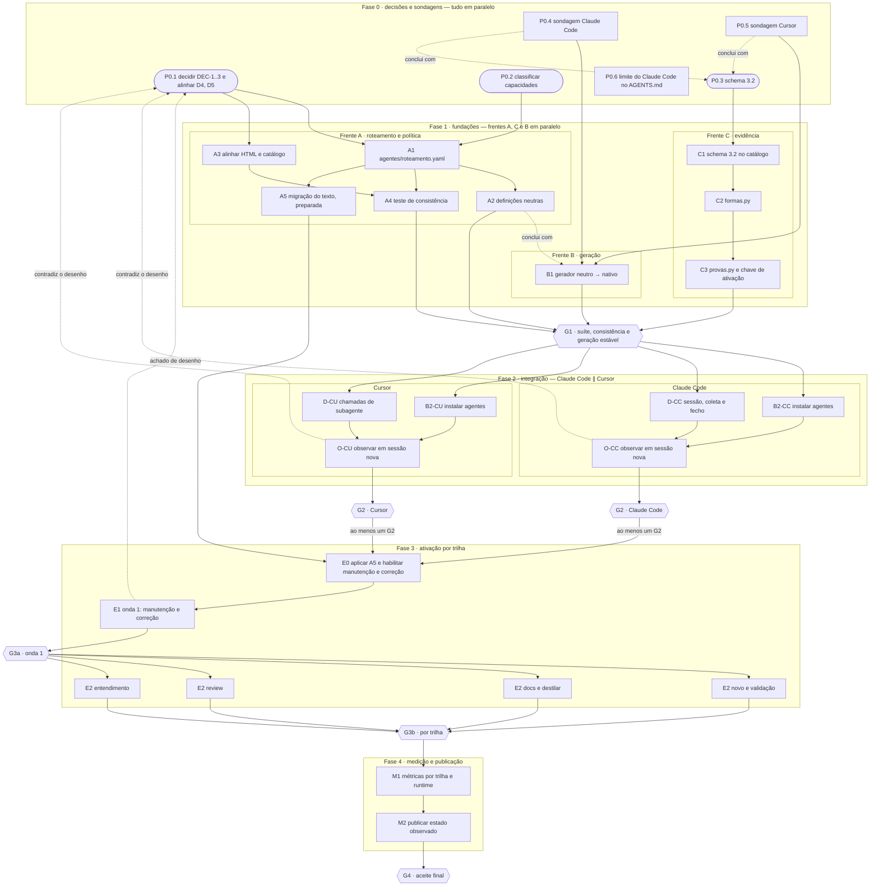
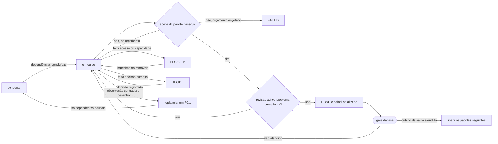

# Implementação do fluxo aprovado de agentes

## Intenção

Hoje um único agente executa o trabalho estruturado na esteira `saneamento_migracao`: ele implementa, verifica e revisa o próprio resultado, e a disciplina depende do modelo. Só o Cursor coleta prova da fatia; no Claude Code nenhuma fatia estruturada chega a um DONE comprovado.

Este plano torna executável, no Claude Code e no Cursor, o fluxo de agentes aprovado no desenho ([trilhas e fluxogramas](user-harness-esteira-v3.html#fluxo-trilha) e [responsabilidades](user-harness-esteira-v3.html#agentes-aprovados)). Ao final:

1. **Papéis certos em cada trilha.** O agente principal coordena, e cada trilha estruturada chama os papéis previstos (`map`, `config`, `implement`, `test`, `refute`, `docs` e `dab`) na ordem aprovada e conforme o contrato da fatia. O principal não substitui um papel obrigatório em silêncio.
2. **Escrita, verificação e revisão separadas.** Quem altera não aprova o próprio trabalho. O teste parte do esperado contratado; a revisão independente recebe intenção e aceite, não o racional do autor; edição posterior invalida as duas.
3. **Execução comprovada por observação.** Chamada, log e artefato registrados pelo adaptador do runtime sustentam que um papel rodou. Relato do agente ou YAML escrito pelo principal não bastam.
4. **Fecho que recusa evidência incompleta.** DONE só é aceito com as chamadas previstas observadas, provas atuais e achados tratados. Sem isso, o fecho é BLOCKED, FAILED ou DECIDE, com motivo e ponto de retomada.
5. **Mesmo comportamento nos dois runtimes**, declarado somente depois de observado em sessão real de cada um.

Para chegar lá, uma fonte única de roteamento gera as definições dos agentes e é conferida contra o desenho; o núcleo de provas passa a registrar chamadas, revisões e inspeções; os adaptadores observam os subagentes; e os agentes obrigatórios são ativados por trilha e por runtime, de forma gradual e reversível. Até essa ativação, as instruções operacionais atuais continuam valendo, para que nenhuma instrução exija um agente ainda não instalado.

O plano não amplia autorização. Guardas, permissões do runtime e as regras de deploy/run do `AGENTS.md` continuam prevalecendo, e nenhum agente libera operação hoje vedada.

## 1. Decisões aprovadas

O agente principal coordena: escolhe o caminho, delimita a fatia, define o aceite, delega, trata retornos, controla orçamento e publica o fecho. Os sete agentes são `map`, `config`, `implement`, `test`, `refute`, `docs` e `dab`. Diagnóstico, inspeção documental e paridade são capacidades; não criar agentes adicionais com esses nomes.

| Trilha estruturada | Sequência aprovada | Condições | Pendência |
|---|---|---|---|
| Novo | map opcional → coordenador → config + implement → test → refute → dab se aplicável → coordenador | Config para YAML, implement para código; dependências determinam sequência. Dab exige critério `ambiente` e autorização registrada. | DEC-1 a DEC-3 aprovadas |
| Manutenção | map opcional → coordenador → test decide/prepara se necessário → config/implement → test → refute → coordenador | Test prepara somente se os casos existentes não decidirem o comportamento contratado. Selecionar escrita por superfície; dab exige critério `ambiente` e autorização registrada. | DEC-1 a DEC-3 aprovadas |
| Correção | diagnóstico com map opcional → coordenador → test reproduz → config/implement corrige → test revalida → refute → dab se aplicável → coordenador | YAML de negócio/ingestão/recurso → config; notebook/Python/SQL → implement. A reprodução usa o mesmo critério: falha esperada autoriza a escrita; aprovação inesperada vai para DECIDE e resultado inconclusivo para BLOCKED. Falha esperada não conclui a correção. Dab exige critério `ambiente` e autorização registrada. | DEC-1 a DEC-3 aprovadas |
| Documentação | map opcional → coordenador → docs → inspeção documental pelo coordenador → refute → coordenador | Não exigir suíte de produto sem relação com o documento. | — |
| Destilar | map opcional → coordenador → docs com distill → inspeção documental pelo coordenador → refute → coordenador | Destino e fonte autorizados; sem duplicar skills de plataforma. | — |
| Validação | coordenador → test → dab se autorizado → test com paridade se exigida → refute → coordenador | Refute foi incluído para alinhar o fluxo ao catálogo. Parar na reprovação conclusiva; não corrigir produto. | — |
| Review | map opcional → coordenador → refute → coordenador | O veredito do artefato é separado do status da tarefa de revisão; indisponibilidade do refute resulta em BLOCKED. | — |
| Entendimento | principal, com map opcional | Sem refute obrigatório; fontes, inferências e preservação de estado verificáveis. | — |

Chamadas de test e refute são obrigatórias onde previstas no caminho estruturado. Config, implement, docs e dab são obrigatórios quando seu gatilho se aplica. Map continua opcional. O caminho simples conserva execução proporcional pelo principal; a classificação não pode ser usada para evitar obrigações de um trabalho estruturado.

Agente obrigatório indisponível impede sucesso da entrega. Registrar BLOCKED e continuar trabalho independente. Se faltar decisão ou autorização humana, usar DECIDE. Permissões superiores do runtime prevalecem; nunca contornar uma proibição de delegação ou operação.

## 2. Estado de partida

Conferido em 2026-10-03 contra o repositório (commit `3454154`).

- `trilhas/README.md` orienta agente único e informa que os papéis não existem.
- `acervo/catalogo.yaml` é inventário sem consumidor executável; os sete agentes estão como `ativacao: opcional`.
- `.claude/agents/`, `.cursor/agents/` e `agentes/` ainda não existem; `adaptadores/gerenciar.py` gera somente hooks.
- Dez skills Databricks estão em `.agents/skills/`. No Claude Code, o plugin `databricks` aparece na sessão principal com o prefixo `databricks:` (por exemplo, `databricks:databricks-core`): 31 skills `databricks-*`, mais `doctor` e `setup`; o HTML cita 29. A carga dentro de subagente não foi observada.
- `implementacao/formas.py` aceita somente contrato, guarda, brief e teste, com produtores `coordenador`, `hook` e `executor_teste`. A forma ataque, do refute, é recusada.
- `implementacao/provas.py` exige comando em todo critério, usa uma única fatia (`principal`) e não registra execução de agentes nem tratamento de achados.
- Cursor coleta provas Shell e solicita correção no stop. Claude Code tem guarda PreToolUse e não tem sessão, coleta nem fecho equivalente.
- A suíte do `AGENTS.md` passa (105 testes unittest e o teste do OpenCode); nenhum teste cobre agentes.

Textos atuais que contradizem o desenho e serão migrados no pacote A5:

| Arquivo | Orientação atual |
|---|---|
| `trilhas/README.md` | Um único agente executa a trilha; não depender de subagentes. O laço comum aceita revisão "sem agente separado". |
| `nucleo/modus-operandi.md` | No estruturado, delegar só com autorização e benefício concreto. |
| `adaptadores/README.md` | Revisor e delegação opcionais. |
| `trilhas/validacao.md` | Sem o passo de refute que o HTML prevê. |
| `acervo/catalogo.yaml` | Agentes opcionais, com gatilhos diferentes do catálogo embutido no HTML (`PECAS`), que já os marca como obrigatórios. |

O roteamento existe hoje em três cópias manuais: `DADOS` e `PECAS` no HTML e o catálogo YAML.

Não considerar configuração presente como evidência de carregamento ou execução real.

## 3. Achados da conferência

### 3.1 Divergências entre HTML e plano

DEC-1 a DEC-3 foram aprovadas em 2026-10-03 e registradas no plano abaixo; D4 e D5 foram alinhados no HTML pelo pacote A3.

| ID | Ponto | HTML | Plano | Proposta | Tipo |
|---|---|---|---|---|---|
| D1 | Quem corrige configuração na correção | Nó "Corrigir achado" com `config / implement`. | Configuração no recorte do implement. | Selecionar pelo tipo de arquivo, como na manutenção: YAML → config, código → implement. Mantém um dono por superfície e evita implement editando YAML de negócio. | DEC-1 — aprovada |
| D2 | Preparação na manutenção | Nó `preparar` (test) sempre antes de alterar. | Sequência omite o passo. | Test prepara somente quando o caso existente não decide o comportamento, como em `trilhas/manutencao.md`. Acrescentar a decisão "Caso cobre?" ao fluxograma e o passo condicional à sequência. | DEC-2 — aprovada |
| D3 | Ambiente em manutenção e correção | Dab só em novo/validação, mas manutenção aceita validação de ambiente. | Idem. | Dab é previsto quando o contrato tem critério `ambiente`, em qualquer trilha de escrita, somente com autorização válida. O gatilho passa a ser o critério, não a trilha. | DEC-3 — aprovada |
| D4 | Review | Sem nó do coordenador antes do refute e sem saída BLOCKED. | coordenador → refute → coordenador; indisponibilidade → BLOCKED. | Alinhar o fluxograma ao plano. | alinhamento |
| D5 | Hook do Cursor em subagente | Afirma que vale para o shell do subagente. | A conferir. | Rebaixar a afirmação para "a observar" até a sondagem P0.5. | alinhamento |

### 3.2 Bloqueios estruturais

Sem tratamento, estes pontos travam trilhas inteiras mesmo com os agentes instalados.

| ID | Bloqueio | Efeito | Tratamento | Pacotes |
|---|---|---|---|---|
| BL1 | Critério sem comando não fecha: o núcleo exige `verificacao.comando` e só aceita evento `teste` vindo do shell (`evidencia/fecho.md` registra o limite). | Docs, destilar e review nunca chegam a DONE pelo núcleo. | Comando condicional ao tipo do critério; registro de inspeção e forma ataque com manifesto do estado avaliado. | P0.3, C1–C3 |
| BL2 | Claude Code sem sessão (`ESTEIRA_SESSAO`) e sem coleta: `fechar` sempre recusa DONE, enquanto o `AGENTS.md` manda o mesmo fluxo para todos os runtimes. | Toda fatia estruturada no Claude Code termina sem DONE. | Declarar o limite já (P0.6); implementar sessão, coleta e fecho (D-CC). | P0.6, D-CC |
| BL3 | A prova é indexada pelo ID de sessão do evento. Subagente com outro ID não encontra a fatia ativa, e o comando passa sem registro. | Test verde em subagente não sustenta DONE; a prova se perde sem aviso. | Sondar os IDs nos eventos de subagente; associar cada chamada à fatia do coordenador; recusar registro órfão. | P0.4, P0.5, C3, D-CC, D-CU |
| BL4 | Capacidades citadas nos fluxos (diagnóstico, paridade, distill, docs-objeto, esteira, novo-objeto, regras, ingestão) são skills candidatas, fora do escopo deste plano. | Pela regra de skill exigida indisponível, correção, destilar e validação com paridade bloqueiam. | Classificar cada uma como obrigatória ou orientativa; a obrigatória vira seção da definição neutra do agente, sem skill nova. | P0.2, A2 |

## 4. Contrato comum dos agentes

Manter uma definição neutra por agente em `agentes/<nome>.md`, incluindo responsabilidade, gatilho, entradas, ferramentas permitidas, skills, capacidades, saída e condição de término. Gerar versões nativas em `.claude/agents/<nome>.md` e `.cursor/agents/<nome>.md`, sem duplicar a política manualmente.

### 4.1 Fonte única do roteamento

`agentes/roteamento.yaml` é a única fonte da matriz: papéis por trilha, ordem, gatilhos, skills e capacidades. As entradas dos sete agentes em `acervo/catalogo.yaml` e as definições nativas são geradas a partir dele. O HTML continua editado à mão; um teste confere `DADOS` e `PECAS` contra o roteamento (responsável por nó, gatilho e trilhas). O teste checa estrutura e não espelha prompt.

Cada agente registra três metadados distintos: `politica: aprovada`, `instalado` por runtime e `observado` por runtime (versão, data e referência do registro).

### 4.2 Gatilhos derivados do contrato

O papel é previsto quando a trilha o prevê na matriz e o contrato tem o sinal correspondente. `iniciar` calcula o plano de chamadas, com a ordem da matriz, e o grava no estado da fatia; o principal não o escreve à mão. A chamada observada pelo adaptador é o que conta como execução.

| Sinal no contrato | Papel previsto | Trilhas |
|---|---|---|
| Superfície com YAML de negócio, ingestão ou recurso | config | novo, manutenção; correção se DEC-1 aprovada |
| Superfície com notebook, Python ou SQL | implement | novo, manutenção, correção |
| Superfície documental | docs | docs, destilar |
| Critério `teste`, `validacao_dados` ou `paridade` | test (reprodução e revalidação na correção) | novo, manutenção, correção, validação |
| Critério `ambiente` com autorização registrada | dab | novo, validação; manutenção e correção se DEC-3 aprovada |
| Critério `inspecao_documental` ou `analise_codigo` | coordenador inspeciona | docs, destilar, review |
| Trilha estruturada, exceto entendimento | refute | novo, manutenção, correção, docs, destilar, review, validação |
| Investigação ampla | map, sempre opcional | todas |

### 4.3 Skills e capacidades por agente

Carregar apenas a skill pertinente ao gatilho da tarefa, registrar as referências utilizadas e não presumir que a carga no principal chegou ao subagente. A classificação das capacidades é proposta para o pacote P0.2.

| Agente | Skills Databricks | Capacidade embutida | Classificação aprovada P0.2 |
|---|---|---|---|
| map | data-discovery, unity-catalog, docs | diagnóstico (com o coordenador) | obrigatória na correção |
| config | dabs, pipelines, jobs | regras, ingestão | orientativas |
| implement | pipelines, jobs, dbsql, python-sdk, dabs | novo-objeto, esteira | orientativas |
| test | dbsql, data-discovery, core; execution-compute só autorizado | paridade | obrigatória quando o contrato tem critério `paridade` |
| refute | as do artefato revisado, somente leitura; docs | — | — |
| docs | docs | distill, docs-objeto | distill obrigatória em destilar; docs-objeto orientativa |
| dab | core, dabs; jobs ou pipelines para run autorizado | escada-validacao, dab-sandbox (regras já em `guardas/` e no `AGENTS.md`) | referência obrigatória às guardas |

Nomes por runtime: Claude Code usa `databricks:databricks-<nome>` (observado na sessão principal; no subagente, a observar em P0.4). Cursor, Codex e OpenCode leem `.agents/skills/databricks-<nome>/SKILL.md`. Skill ausente gera limitação visível; capacidade obrigatória ausente gera BLOCKED para o trabalho dependente.

### 4.4 Entradas, saídas e restrições

| Agente | Entradas essenciais | Saída verificável | Restrição |
|---|---|---|---|
| map | pergunta, escopo, fontes e baseline | mapa de fontes, dependências, recorte e incertezas | Sem edição de produto |
| config | contrato, arquivos YAML, template e requisitos | arquivos alterados, vínculos com requisitos e estado | Somente superfície atribuída |
| implement | contrato, template/irmão vivo, dependências e skills | alteração, manifesto e critérios a verificar | Sem mudar o aceite unilateralmente |
| test | critério, esperado, comando/ambiente e estado | logs reais, resultados, cobertura e manifesto | Sem corrigir produto ou enfraquecer o esperado; preparação de suíte só no escopo atribuído |
| refute | intenção, aceite, baseline, estado atual e provas | veredito, tentativas, achados (inclusive simplificação, seção 4.5), evidências e limites | Sem editar produto; não receber racional persuasivo do autor |
| docs | contrato, documentos e fontes vivas | documento/instrução e referências | Somente arquivos atribuídos |
| dab | operação, autorização, target/perfil, seleção e pré-condições | resultado real, IDs, logs e destinos observados | Guarda obrigatória; sem retry cego de efeito externo |

Identificar execução, fatia, tentativa, chamada, papel e estado relevante em cada retorno. Hashes comprovam compatibilidade do conteúdo, não autenticam autoria. A chamada observada pelo adaptador sustenta que o papel foi executado; um YAML escrito pelo principal não basta.

### 4.5 Simplicidade

Vale para todos os agentes, no código, no texto e na fala. A simplificação nunca passa por cima, nesta ordem, das regras do harness e do `AGENTS.md` do produto nem das boas práticas Databricks do contexto, lidas na skill pertinente (seção 4.3).

- Escrever o menor código que cumpre o aceite. Cada trecho novo é justificado por um critério, requisito ou dependência; abstração, parâmetro, validação ou camada sem uso atual não entra.
- Reutilizar o que o repositório já tem (irmão vivo, template, função existente) antes de criar algo paralelo.
- Retornos, documentos e fechos dizem o necessário para decidir, de forma direta, sem repetição nem enchimento.
- O princípio cobre o que acompanha o código: comentários, docstrings, código comentado, logs e prints de depuração, configuração sem uso e documentação duplicada. Comentário que repete o código, está desatualizado ou guarda código morto é removível. Comentário que explica o porquê (regra de negócio, decisão não óbvia, vínculo com requisito) fica.
- Em toda revisão, inclusive na trilha review, o refute pergunta: "Isto pode ser simplificado e chegar ao mesmo resultado?" Se sim, registra um achado `simplificacao` com o trecho removível ou a versão mais simples.
- Nas trilhas de escrita, o achado é procedente quando a versão simples mantém o comportamento e passa nos mesmos critérios do contrato, dentro da superfície. Então simplificar é a saída: o achado volta ao autor e segue o tratamento de qualquer achado procedente (orçamento, novo teste e nova revisão). Preferência de estilo sem ganho de volume ou de clareza não é achado.
- Na trilha review, o refute não edita: o achado entra no veredito com severidade e local, e a tarefa de revisar pode fechar DONE com `com_achados`, como qualquer outro achado.
- Boa prática Databricks não é excesso. Exemplos: expectations de qualidade em pipeline (`databricks-pipelines`); timeout, retry e notificação em job (`databricks-jobs`); `COMMENT` em tabela e coluna, que é metadado de governança e descoberta, não comentário de código (`databricks-dbsql`, `databricks-unity-catalog`); permissões e estrutura do bundle (`databricks-dabs`). Antes de propor simplificação em artefato Databricks, o refute consulta a skill do contexto e cita a referência no achado. Simplificação que contraria a boa prática é descartada com essa referência.

## 5. Fases e pacotes

Cada pacote é uma mudança revisável no Git do harness, com aceite próprio e a suíte do `AGENTS.md`. Pacotes sem dependência entre si rodam em paralelo. "Conclui com X" marca início antecipado: o pacote pode começar sobre fixture, mas só fecha depois de X.

| Roda em paralelo | Depende de ordem |
|---|---|
| Todos os pacotes da Fase 0 (P0.3 conclui com P0.4 e P0.5) | A1 → A2 e A1 → A5; C1 → C2 → C3 |
| Frentes A, C e B na Fase 1; A3 junto com A1 | G1 antes de instalar agentes em qualquer runtime |
| Claude Code e Cursor na Fase 2 | Instalação e adaptador → observação → G2 do runtime |
| Trilhas da onda 2 entre si | E0 → onda 1 → G3a → onda 2 → G3b → Fase 4 |

Caminho crítico: P0.4/P0.5 → P0.3 → C1 → C2 → C3 → G1 → D-xx → O-xx → G2 → E0 → E1 → G3a → E2 → G3b → M1 → M2. A frente C define o prazo; priorizá-la.

### Fase 0 — Decisões e sondagens

| ID | Pacote | Responsável | Depende de | Saída verificável |
|---|---|---|---|---|
| P0.1 | Decidir DEC-1, DEC-2 e DEC-3; registrar D4 e D5 | humano, com a proposta da seção 3.1 | — | Seção 1 sem pendência aberta |
| P0.2 | Classificar capacidades e skills candidatas (BL4) | humano, com a proposta da seção 4.3 | — | Tabela 4.3 aprovada |
| P0.3 | Desenho do schema 3.2 (seção 5, "Schema 3.2") | coordenador e humano | conclui com P0.4 e P0.5 | Campos e compatibilidade aprovados |
| P0.4 | Sondagem Claude Code | agente | — | Relatório com versão, documentação consultada e eventos observados |
| P0.5 | Sondagem Cursor | agente | — | Idem |
| P0.6 | Declarar no `AGENTS.md` e no README do adaptador que, no Claude Code, `fechar` recusa DONE até D-CC; a fatia estruturada fecha com status de impedimento e motivo, ou roda no Cursor | agente | — | Texto revisado e suíte verde; entrega imediata, independente do resto |

Perguntas das sondagens, respondidas com documentação oficial atual e observação na versão instalada:

1. Quais campos de frontmatter a versão aceita (ferramentas, herança de modelo, pré-carga de skills)?
2. O subagente recebe `AGENTS.md`/`CLAUDE.md` e as skills do plugin ou de `.agents/skills/`?
3. Os hooks de shell disparam para ferramentas do subagente? Com quais IDs (sessão, conversa, agente, pai)?
4. Há evento de início e fim de subagente, e ele permite associar a chamada à sessão principal?
5. Claude Code: como obter o ID da sessão para `--sessao`, qual evento coleta o resultado da ferramenta e qual pede correção no fim.
6. A guarda de bundle nega dentro do subagente? Observar uma negação real, sem efeito.

Resultado bruto em `.execucoes/sondagens/`; resumo versionado no README do adaptador, com versão e data.

### Fase 1 — Fundações

| ID | Frente | Pacote | Depende de | Saída verificável |
|---|---|---|---|---|
| A1 | A | `agentes/roteamento.yaml` com matriz, ordem, gatilhos (4.2), skills e capacidades (4.3) e metadados (4.1) | P0.1, P0.2 | Cada nó tem responsável e cada condição tem destino |
| A2 | A | Sete definições neutras `agentes/<nome>.md` | A1 | Campos da seção 4 completos; capacidades obrigatórias embutidas |
| A3 | A | Alinhar o HTML (D1–D5) e os metadados do catálogo (aprovado × instalado × observado) | P0.1 | Desenho e catálogo concordam, sem comportamento novo |
| A4 | A | Teste de consistência entre roteamento, HTML e catálogo | A1, A3 | Falha com divergência real e passa no estado alinhado |
| A5 | A | Preparar a migração do texto operacional (`AGENTS.md`, núcleo, trilhas, acervo, adaptadores) sem aplicar | A1 | Diff pronto; aplicado só em E0 |
| C1 | C | Schema 3.2 em `formas/catalogo.yaml` | P0.3 | Catálogo versionado; registros 3.1 continuam legíveis |
| C2 | C | `formas.py`: ataque, inspeção, triagem e chamada; produtor por papel | C1 | Testes de aceite e recusa por forma |
| C3 | C | `provas.py`: plano de chamadas, critério sem comando, invalidação por edição, atribuição por fatia e papel, chave de ativação | C2 | Testes dos cenários da seção 8 que não dependem de runtime |
| B1 | B | Gerador e verificador neutro → nativo em `gerenciar.py` ou script próprio: idempotente, preserva configuração existente, detecta divergência | P0.4, P0.5; conclui com A2 | Segunda geração sem diferença; divergência manual detectada |

Chave de ativação (C3): `configuracao/politica.json` ganha `agentes_obrigatorios`, com a lista de trilhas habilitadas por runtime, inicialmente vazia. Com a chave vazia, o fecho se comporta como hoje. Com a trilha habilitada, `fechar` exige as chamadas previstas observadas, provas atuais e achados tratados.

Gate G1: suíte do `AGENTS.md` verde, A4 verde e B1 gera os sete agentes de A2 sem diferença na segunda execução.

### Fase 2 — Integração por runtime

Claude Code e Cursor avançam em paralelo e de forma independente.

| ID | Pacote | Depende de | Saída verificável |
|---|---|---|---|
| B2-CC | Instalar os sete agentes no Claude Code | G1 | `.claude/agents/*.md` gerados e sem divergência |
| B2-CU | Instalar os sete agentes no Cursor | G1 | `.cursor/agents/*.md` gerados e sem divergência |
| D-CC | Adaptador Claude Code: sessão, coleta de prova, chamada de subagente observada e conferência de fecho | G1 | Testes de tradução dos eventos sondados em P0.4 |
| D-CU | Adaptador Cursor: chamada de subagente observada e associação à fatia do coordenador | G1 | Testes de tradução dos eventos sondados em P0.5 |
| O-CC | Observar em sessão nova: descoberta dos sete, chamada real, recorte respeitado, skill pertinente carregada, guarda negando no subagente | B2-CC, D-CC | Registro em `.execucoes/` e resumo no README do adaptador |
| O-CU | Idem no Cursor | B2-CU, D-CU | Idem |

Gate G2, por runtime: observação aceita. O runtime que não passa G2 não é ativado; o outro segue.

### Fase 3 — Ativação controlada por trilha

| ID | Pacote | Depende de | Saída verificável |
|---|---|---|---|
| E0 | Aplicar A5 e habilitar manutenção e correção na chave, para os runtimes aprovados em G2 | G2 de ao menos um runtime, A5 | Política e chave coerentes; esvaziar a chave restaura o comportamento atual |
| E1 | Onda 1: cenários de manutenção e correção | E0 | Registros e métricas da onda |
| E2 | Onda 2, em paralelo: novo e validação (dab só em sandbox), docs e destilar, review, entendimento | G3a | Registros e métricas por trilha |

Gate G3a: onda 1 sem falso DONE, sem violação de escopo e com chamadas previstas iguais às observadas. Gate G3b: o mesmo critério por trilha da onda 2; a trilha que falhar fica desabilitada e as demais seguem. Runtime aprovado em G2 depois da onda 1 entra pelo seu próprio E0.

### Fase 4 — Medição e publicação

| ID | Pacote | Depende de | Saída verificável |
|---|---|---|---|
| M1 | Métricas por trilha e runtime (seção 8) | G3b | Tabela com chamadas esperadas/observadas, defeitos, falsos positivos, falso DONE, tempo, custo, ciclos e volume de código |
| M2 | Atualizar README, HTML e adaptadores com o implementado e o observado; declarar equivalência só onde observada | M1 | Estado publicado separado do que permanece pendente |

Gate G4: aceite final (seção 8).

### Schema 3.2 (P0.3)

Aprovado em 2026-10-03. Reaberto depois da sondagem P0.4 para decidir o executor do teste, e decidido em 2026-10-05 (dois últimos itens da lista). A P0.5 confirma o mapeamento do lado do Cursor: qual ID do evento identifica o subagente e de onde vem o exit code.

- Plano de chamadas calculado por `iniciar` a partir de `agentes/roteamento.yaml` e do contrato, gravado no estado, nunca no contrato escrito pelo principal.
- `verificacao.comando` obrigatório para `teste`, `ambiente`, `validacao_dados` e `paridade`. Para `inspecao_documental` e `analise_codigo`, `caminhos` e lista de checagens, com produtor coordenador ou refute.
- Forma `ataque`: estado revisado (manifesto), veredito, tentativas, cobertura e achados com id, categoria (inclusive `simplificacao`), severidade, local e evidência.
- Forma `triagem`: revisão de origem, achado, decisão (procedente ou descartado), responsável, evidência da resolução ou motivo do descarte.
- Forma `inspecao`: critério, caminhos, manifesto, checagens e resultado. Edição relevante a invalida, como acontece com o teste.
- Forma `chamada`: papel, runtime, IDs observados, início, fim e status. Produtor é o adaptador, nunca o principal.
- Produtores: `coordenador`, `hook`, `executor_teste` e os sete papéis.
- Compatibilidade: registros 3.1 seguem legíveis e não recebem revisão independente presumida.
- Triagem, inspeção e chamada são formas próprias; as quatro formas 3.2 ficam adotadas após C2 validar os payloads. As demais formas candidatas não são adotadas.
- Executor do teste: a forma `teste` continua produzida por `executor_teste`, observada pelo hook, inclusive quando o comando roda num subagente. Ela ganha `agente_id`, o ID do subagente lido nos eventos do runtime. Com a trilha ativada e `test` no plano, o critério `teste`, `validacao_dados` ou `paridade` só fecha se esse ID casar com um `agente_id` de uma `chamada` concluída do papel `test`; senão a pendência é `teste_fora_do_test`. Um teste rodado pelo principal não substitui o papel.
- Exit code: a forma `teste` ganha `exit_code_origem`, com três valores. `campo_resultado` é o campo numérico do runtime (o `exitCode` do Cursor). `evento_sucesso` é o evento de sucesso sem código, que vale 0 (o `PostToolUse` do Claude Code). `texto_falha` é o código lido no texto do evento de falha, diferente de 0 (o `Exit code N` do `PostToolUseFailure`). Formato inesperado mantém `exit_code: null`, ou seja, resultado inconclusivo. Os dois campos são opcionais e aditivos, e registros anteriores continuam válidos.

## 6. Grafo de execução

Retângulo: pacote executado por agente. Cápsula: decisão humana. Hexágono: gate. Seta tracejada para frente: início antecipado ("conclui com"). Seta tracejada para P0.1: retorno de controle quando uma observação contradiz o desenho.

## 7. Controle

### 7.1 Ciclo de cada pacote

### 7.2 Regras

1. Um pacote só inicia com as dependências concluídas. Exceção: início antecipado ("conclui com"), sobre fixture; a conclusão continua dependente.
2. Cada pacote fecha com um status de `evidencia/fecho.md` e referência ao commit ou registro. Até D-CC, o pacote executado no Claude Code declara no fecho que a prova da fatia não é coletada nesse runtime.
3. Orçamento padrão do núcleo por pacote: até 3 ciclos de correção e parada após 2 ciclos sem progresso.
4. Observação que contradiz o desenho (sondagem, observação de runtime ou cenário) volta para P0.1. Pausam só os pacotes dependentes; o trabalho independente continua.
5. A ativação é por trilha e runtime, pela chave `agentes_obrigatorios`. Esvaziar a chave é o rollback e não remove agentes instalados.
6. Até G2, a revisão dos pacotes é humana sobre o diff. Depois de G2, o refute do runtime aprovado pode revisar pacotes do harness, sem substituir a decisão humana dos pacotes P0.
7. O painel abaixo é atualizado a cada mudança de status.

### 7.3 Painel

| Gate | Pacotes | Critério de saída | Status |
|---|---|---|---|
| — | P0.1–P0.6 | Decisões registradas e sondagens com evidência | P0.1–P0.2 aprovados; P0.3 decidido (2026-10-05: executor do teste e origem do exit code), mapeamento do Cursor a confirmar em P0.5; P0.4 concluído (2026-10-04; refeito em 2026-10-05 no CLI 2.1.289 com brutos preservados em `.execucoes/sondagens/`; resumo no README do adaptador Claude Code); P0.5 com kit pronto, aguarda sessão real no Cursor; P0.6 concluído |
| G1 | A1–A5, C1–C3, B1 | Suíte e A4 verdes; geração estável | A1–A4 e C1–C3 concluídos (commit `7ead2ae`); C1–C3 fecharam antes da reabertura do P0.3 e foram complementados com a decisão de 2026-10-05; A5 preparado; B1 aguarda P0.5; G1 pendente |
| G2 Claude Code | B2-CC, D-CC, O-CC | Observação aceita em sessão nova | pendente |
| G2 Cursor | B2-CU, D-CU, O-CU | Observação aceita em sessão nova | pendente |
| G3a | E0, E1 | Onda 1 sem falso DONE e com chamadas previstas = observadas | pendente |
| G3b | E2, por trilha | Mesmo critério, por trilha | pendente |
| G4 | M1, M2 | Aceite final | pendente |

## 8. Cenários e aceite final

Começar pelos cenários de manutenção e correção (onda 1). Depois cobrir novo, validação, docs, destilar, review e entendimento (onda 2). Os cenários sem dependência de runtime entram como testes de C3.

| Cenário | Resultado esperado |
|---|---|
| Manutenção de código correta | implement → test → refute; fecho com evidências atuais |
| Manutenção somente YAML | config → test → refute; sem implementação de código artificial |
| Teste verde, requisito ausente | refute encontra lacuna; correção e nova validação/revisão |
| Correção de bug | reprodução falha como esperado; correção passa no mesmo critério |
| Achado falso positivo | descarte fundamentado sem alteração desnecessária |
| Código correto, porém excessivo | refute aponta a versão mais simples; o autor simplifica; test confirma o mesmo resultado nos mesmos critérios |
| Review com comentário redundante ou código comentado | achado `simplificacao` no veredito, sem edição; comentário que explica o porquê é preservado |
| Simplificação que remove boa prática Databricks (por exemplo, uma expectation) | achado descartado com a referência da skill; artefato mantido |
| Edição depois do aceite/revisão | provas anteriores não fecham DONE |
| Agente/skill exigido indisponível | limitação explícita e BLOCKED para o trabalho dependente |
| Validação reprovada | FAILED sem editar produto |
| Review com achados | DONE da tarefa, veredito com_achados do artefato |
| Documentação/destilação | inspeção documental e refute, sem suíte irrelevante |
| Entendimento/caminho simples | fontes verificadas e preservação de estado, sem delegação obrigatória |
| Duas sessões ou escritores concorrentes | sem mistura de provas, autoria atribuída e estado compatível |
| Test executado em subagente | prova associada à fatia do coordenador; nenhum registro órfão |
| Critério de inspeção documental | fecha com registro de inspeção; edição posterior o invalida |
| Fecho sem chamada prevista observada | DONE recusado nos dois runtimes |
| Chave de ativação vazia | comportamento atual preservado, sem exigir agente |
| Ambiente em manutenção (se DEC-3 aprovada) | dab chamado só com critério `ambiente` e autorização válida |

Rodar os checks exigidos pelo `AGENTS.md` e testes focados nas novas garantias. Não adicionar testes que apenas espelhem prompts. Executar os cenários de ativação no chat de Claude Code e Cursor, preservando registros sob `.execucoes/` sem segredos.

Medir por trilha e runtime: chamadas esperadas/observadas, defeitos encontrados por refute, falsos positivos, falso DONE, tempo, custo, ciclos de correção, linhas adicionadas e removidas por fatia e achados de simplificação.

Aceite final (G4): matriz e gatilhos exercitados nos dois runtimes; fecho recusa evidência incompleta; revisão independente ocorre onde prevista; guardas existentes passam suas regressões; README e HTML separam o observado do pendente.

## 9. Limites

Fora deste plano: implementar todos os candidatos do acervo de uma vez, recriar a receita perdida da esteira, mudar regras do produto, autorizar deploy/run, escolher modelos específicos ou prometer independência apenas por trocar de modelo. Herança de modelo continua sendo o padrão nas definições nativas.

Referências técnicas para a implementação: [subagentes Claude Code](https://code.claude.com/docs/en/sub-agents), [subagentes Cursor](https://cursor.com/docs/subagents) e documentação oficial de hooks/skills de cada runtime. Conferir novamente nas sondagens P0.4 e P0.5, pois os recursos e campos variam por versão.
