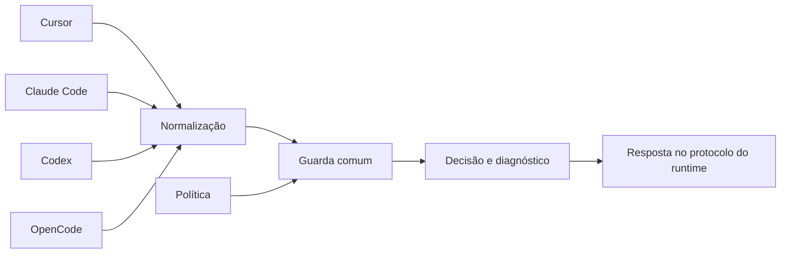

# Arquitetura dos adaptadores

A política de negócio é única. Nome de evento, origem do cwd, protocolo de negação e instalação pertencem ao adaptador. Política em [guardas](../guardas/README.md). Cobertura e instalação por runtime em [adaptadores](README.md).



## Raiz

A raiz é o checkout `user-harness-esteira/`. Abra sempre essa pasta, não a pasta do produto. O produto é um clone Git independente em `prj-avante-analytics-adb/`, ignorado pelo Git do harness. A configuração dos runtimes fica dentro da raiz. Nada é global e o instalador não toca credenciais nem aprova ferramenta.

## Mapa de módulos

| Módulo | Papel |
|---|---|
| `implementacao/guarda_cwd.py` | Recebe `Operacao(fase, ferramenta, comando, cwd, origem_cwd)`. Decide diretório, nome do bundle e comando literal. Não conhece nomes de evento. |
| `implementacao/guarda_efeito.py` | Target, perfil e plan antes de deploy (recibos). Não executa a CLI. |
| `implementacao/formas.py`, `implementacao/provas.py` | Validam as quatro formas adotadas (`contrato`, `guarda`, `brief`, `teste`). Gravam baseline, resultados e fecho, com hashes. |
| `configuracao/politica.json` | `bundle_local`, `bundle_nome`, `registros_raiz`. Caminhos relativos ao arquivo. |
| `adaptadores/entrada.py` | Ponto de entrada dos hooks. Acha o checkout pelo próprio arquivo e prefere o Python de `.venv`. |
| `adaptadores/executar.py` | Lê UTF-8/JSON, carrega a política, chama a guarda, grava o diagnóstico e responde no protocolo nativo. Falha tratada sai com código 2. |
| `adaptadores/protocolo.py` | Normaliza os quatro protocolos e traduz a decisão de volta. |
| `adaptadores/gerenciar.py` | Mostra ou instala a configuração, preservando o que já existe. |
| `adaptadores/prova.py` | CLI `iniciar`, `estado` e `fechar` da fatia. Uso: [evidencia/uso.md](../evidencia/uso.md). |
| `adaptadores/cursor/prova.py` | Traduz os eventos de coleta do Cursor. |
| `adaptadores/opencode/esteira.js` | Ponte do plugin. Chama Python sem shell, com timeout, e lança erro quando a guarda nega ou falha. |

## Protocolo

| Runtime | Negação | Origem do cwd aceita |
|---|---|---|
| Cursor | `permission: deny` | `cwd` do evento de shell |
| Claude Code | `permissionDecision: deny` ou exit 2 | Só o prefixo literal no comando |
| Codex | `permissionDecision: deny` ou exit 2 | `tool_input.workdir`, ou prefixo literal |
| OpenCode | Exceção antes da execução | `args.workdir`, ou prefixo literal |

- Decisão positiva não amplia permissão do runtime. Cursor recebe `allow`; Claude Code e Codex recebem só contexto; OpenCode não altera argumentos.
- Prefixos aceitos: `Set-Location -LiteralPath 'absoluto' -ErrorAction Stop;` (PowerShell) e `cd -- 'absoluto' &&` (Bash). Target: `DATABRICKS_BUNDLE_TARGET=valor` logo antes de `databricks`, `databricks.exe` ou `databricks.cmd`.
- O adaptador não converte o shell, não troca o target e não repete a chamada. A recuperação é do coordenador, dentro da autorização original.
- Diagnóstico: `.execucoes/<runtime>/cwd_bundle/<evento_id>.json` (versão 2, sem comando nem perfil). Coleta de prova do Cursor: `.execucoes/provas/` (versão 3.1).
- Hooks usam `py -3` no Windows e `python3` no POSIX (`--plataforma windows|posix`). Trocar a plataforma substitui só a definição gerada por nós.

## Limites reais

- Só shell. `bundle run`, `destroy` e `sync` são negados; MCP, SDK, REST, edição de arquivo e terminal manual não passam pela guarda.
- Deploy fica negado: identidade autenticada e destinos resolvidos não são conferidos.
- Os mecanismos diferem em crash e timeout. Não presuma equivalência.
- Só o Cursor coleta prova e retoma o fecho.
- Fecho em prosa não é interceptado.

## Fontes dos protocolos

- [Cursor Hooks](https://cursor.com/docs/hooks)
- [Claude Code Hooks](https://code.claude.com/docs/en/hooks)
- [Codex Hooks](https://learn.chatgpt.com/docs/hooks)
- [OpenCode Plugins](https://opencode.ai/docs/plugins/)

## Testes locais

```powershell
py -3 -m unittest discover -s testes -p teste_*.py -v
node testes/teste_opencode.mjs
```

Cobrem as quatro traduções, subprocessos reais, instalação idempotente e relocação do clone. Fixtures e registros ficam em `.execucoes/testes/`.
